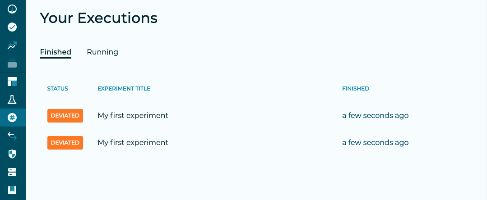
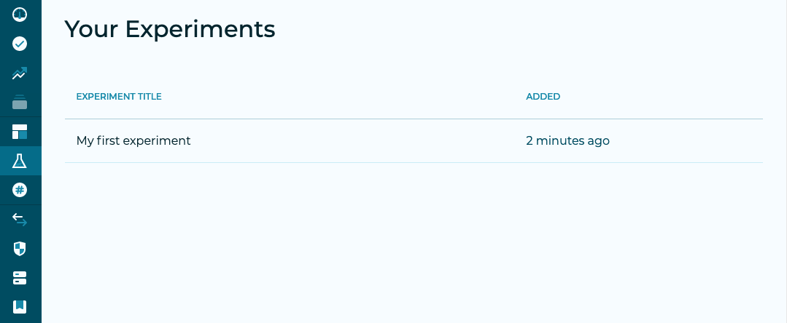
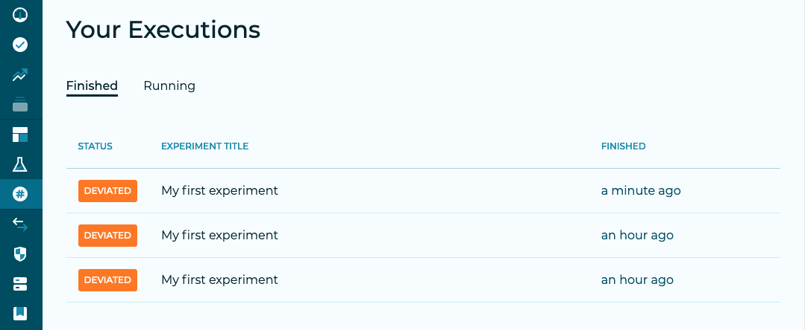
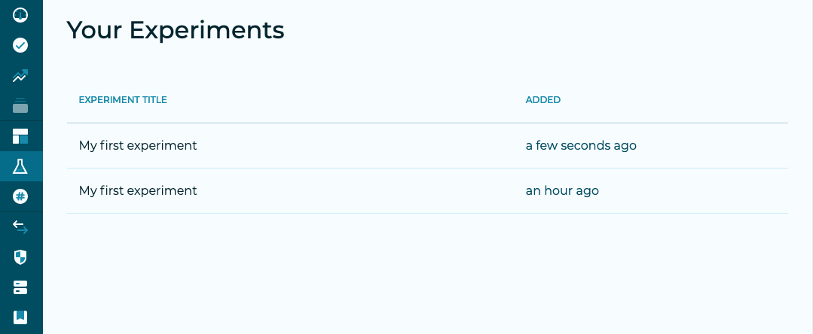

**When a user runs an experiment for the first time**, and publishes it to ChaosIQ, a new experiment is added to your experiments list. A new execution, which corresponds to this particular run, is also created.

If **the same user runs the same experiment again**, a new execution will be listed. But only one experiment will still be listed, as ChaosIQ knows the experiment that was run is already listed.

## With multiple users

If **another user runs the same experiment** from their local environment and publishes it to the same team, it will be considered as a different experiment.

### Letting ChaosIQ know the same experiment is being run by different users

If you want those **two experiments to be considered as only one experiment**, even when they are run by different users, you can use two different methods.

#### Using the experiment URL

Clicking on your experiment from the list view will take you on that experiments page.

There, you can copy the experiment's URL and use it for your next executions. ChaosIQ will then consider all those runs as executions of the same experiment.

#### Commiting the .chaosiq file

When you run an experiment, ChaosIQ creates (or updates) a `.chaosiq` file in the experiment's directory. If you commit this file to a Git repository, along with your experiment, pull it before each execution and push it after the experiment has run, all executions from this experiment, whoever ran it, will be treated as coming from a single experiment.