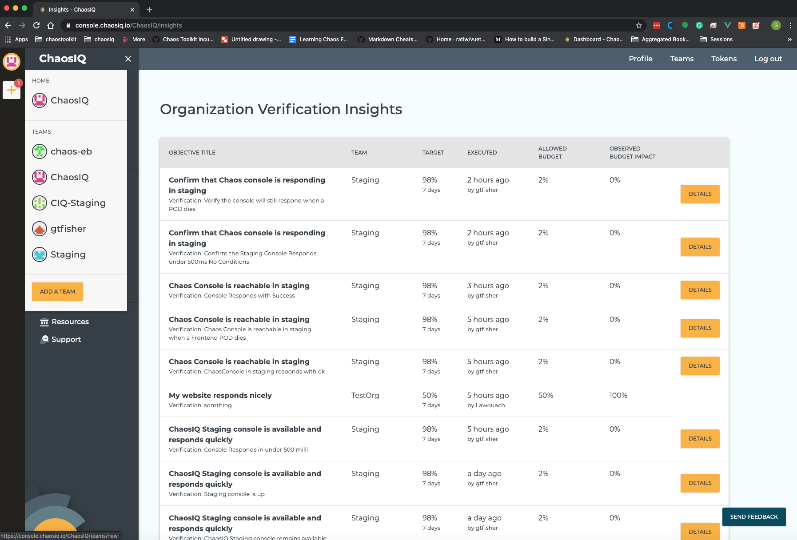
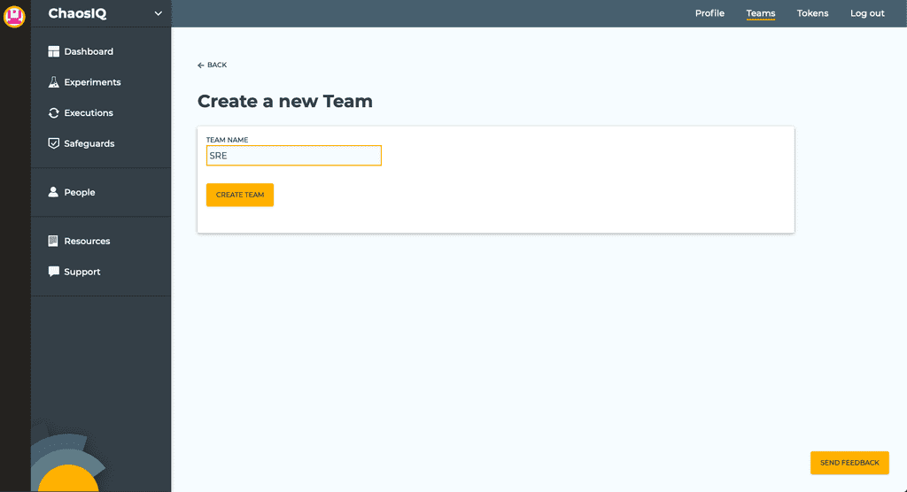
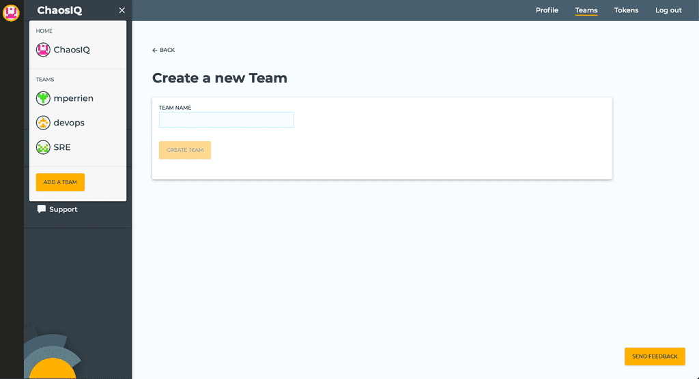
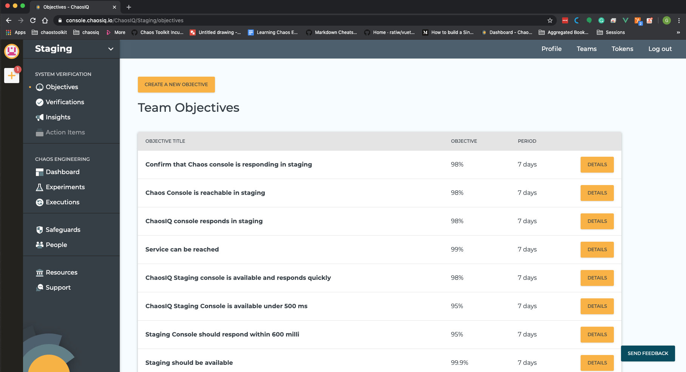
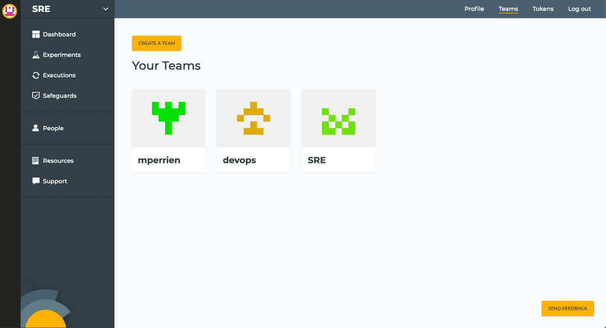
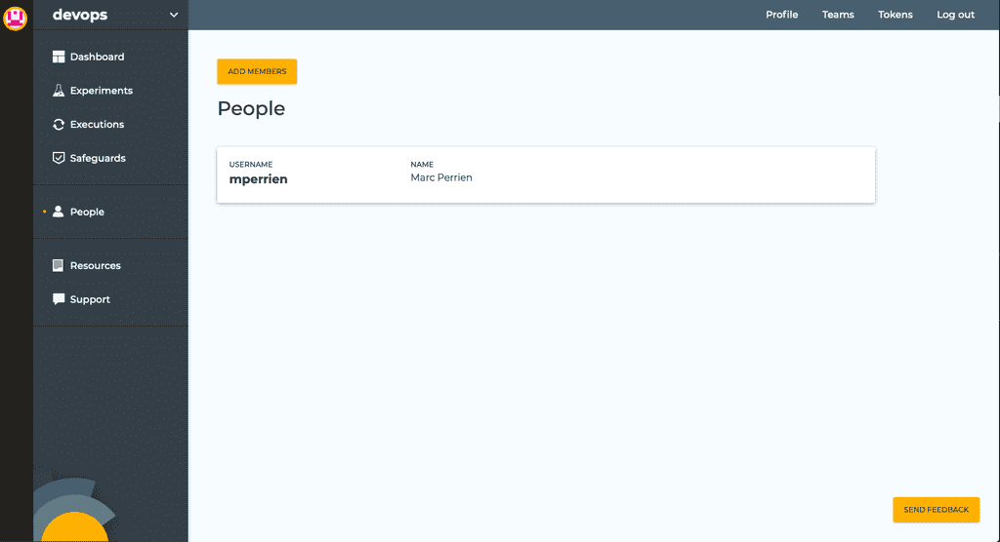
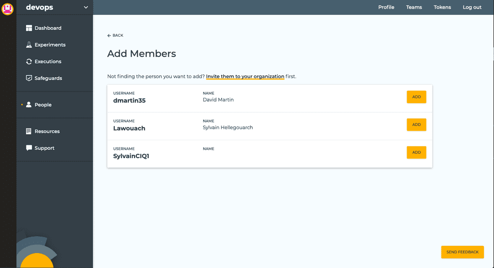

You can create an unlimited number of teams in your organization. Teams can be used to gather real-life teams or members of different teams working on common projects. They are a flexible model that should be able to fit the way you and your teammates want to work.

Opening the Teams dropdown in the top-left corner of the window will list your available teams as well as allow you to create a new one.

Click the *Add a team* button. On the *Create a new Team* page, you are asked to choose a name for your organization.

When you are happy with your team name, click the *Create Team* button. A message will appear, telling you your organization was successfully created.

This new organization is now listed in the top-left Teams menu.

Clicking on its name will take you to the new teams' Objectives.

Alternatively, you can use the *Teams* link in the top menu to view a list of the organizations you belong too and create new ones.

## Adding members to a team

In a team view, click on the *People* link in the sidebar menu to display the list of all this team's members.

Click on the *Add members* button to display a list of all people that can be added to this team (they are the people in your organization that are not yet members of this team).

