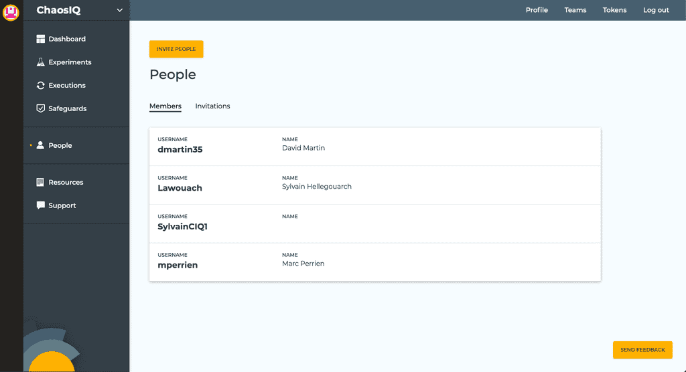
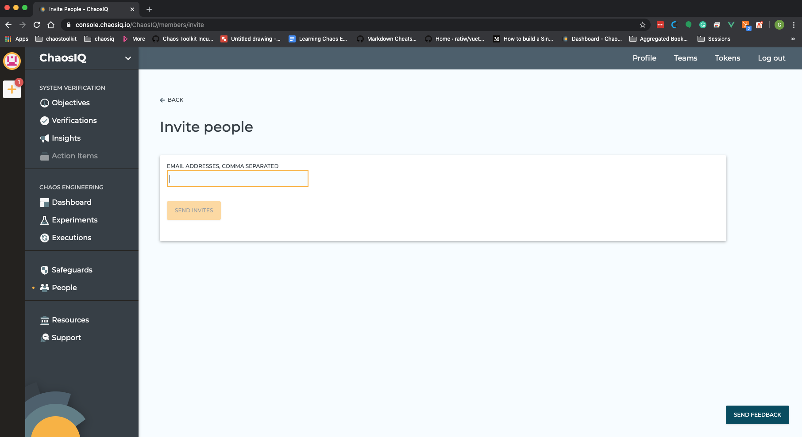

From the organization view, click on the *People* link in the sidebar to display a list of the members of your organization.

Click on the *Invite people* button to invite people to join the organization. Enter a comma-separated Email list and invites will be sent when you select the *Send Invites* button.

## Joining an organization

When you have been invited to join an organization, signing in to ChaosIQ will automatically make you a member of this organization.