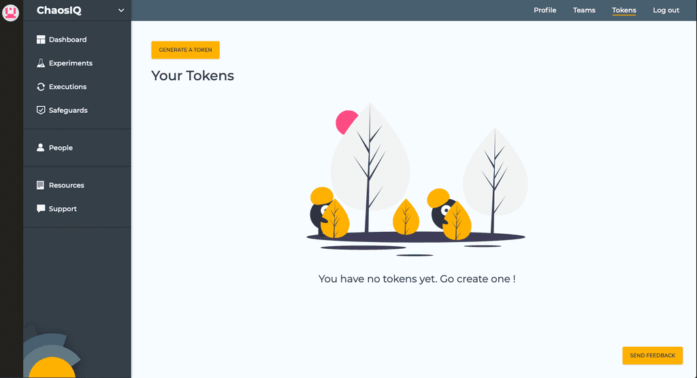
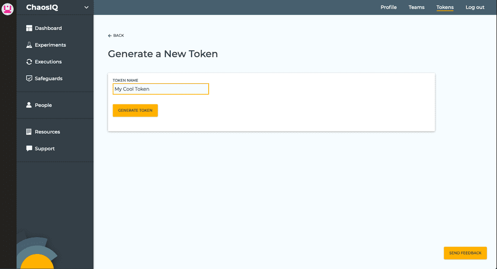
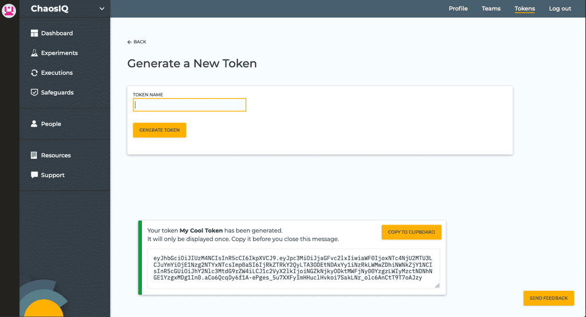
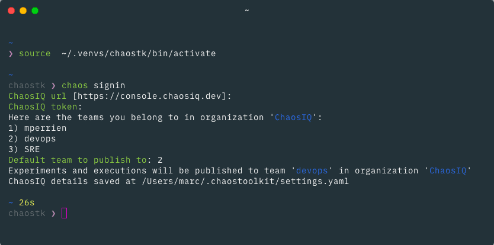
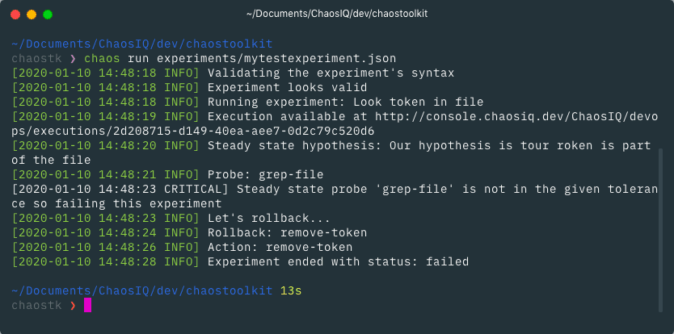
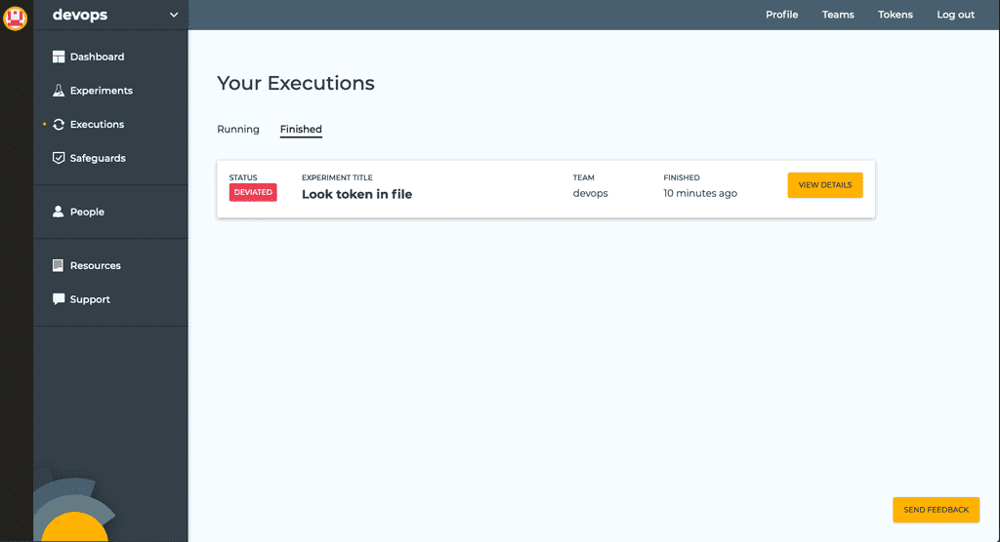

For Chaos Toolkit to send Verifications and Executions data to a team, you must have the ChaosIQ Cloud extension installed.

```
$ pip install -U chaosiq-cloud
```

Then, sign in to ChaosIQ

```
$ chaos signin
```

You will be asked the URL of ChaosIQ. It defaults to https://console.chaosiq.io, for SaaS users. If you use an an alternative deployment, change it to your URL and your choice will be remembered next time you sign in.

ChaosIQ then asks for a token to identify you. To generate a new token, click on the *Tokens* link from the top menu.



Click on *Generate a Token* to create a new token.



Once you have chosen a name for your token, click on the *Generate Token* button. A message is displayed with your token. Copy it, then switch back to your terminal and paste it.



Chaos Toolkit will then retrieve the list of organizations you belong to and asks you to choose which one you will publish to. If you only belong to one organization, ChaosIQ will skip this step. You are then asked to select which team you want to publish your experiments to. Select the one you want, and you are ready to run experiments.



If you run an experiment with the `chaos run` command, it will now be published to ChaosIQ and available on the Executions page.




