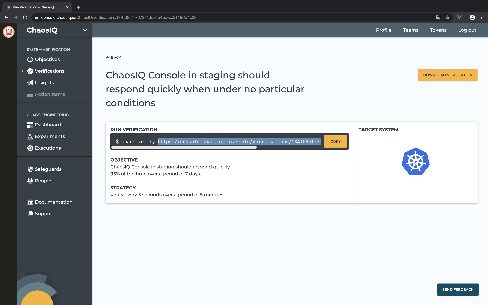

Now that you setup successfully your operator and your ChaosIQ secrets,
we'll show you on how to create the Chaos Experiment definition to pass to the
operator.

To run Chaos Toolkit with ChaosIQ as a kubernetes pod, we provide a default
[docker image][dockerImage], but you can create your own, with additional
extensions if needed, as described in the [documentation][CustomDockerImage].
The default image will be downloaded from the [docker hub][ChaosIQCTK].

First, get the asset URL for either the verification or the experiment from
the ChaosIQ console. Copy the URL from the `chaos` command, or right-click
on the downlad button to copy the target link.



Your verification or experiment URL shall be like the following pattern:
`https://console.chaosiq.io/assets/[verifications|experiments]/<uuid>.json`

Then, you shall use the following template, with your own asset URL, to create
a Chaos Toolkit Experiment definition. You must modify the command arguments to
`verify` or `run` an experiment with your own asset URL, update the pod image
if you created a custom ChaosIQ [docker image][CustomDockerImage], update the
settings secret name if desired. You can also customize your manifest following
the official [documentation][k8sOperatorDoc].

```yaml
---
apiVersion: chaostoolkit.org/v1
kind: ChaosToolkitExperiment
metadata:
  name: my-chaos-exp
  namespace: chaostoolkit-crd
spec:
  namespace: chaostoolkit-run
  pod:
    image: chaosiq/chaostoolkit
    chaosArgs:
    - verify
    - https://console.chaosiq.io/assets/verifications/134f08a1-7072-4de3-b4bc-ca21486b4c23.json
    settings:
      enabled: true
      secretName: chaostoolkit-settings
    experiment:
      asFile: false
```

Save that manifest into a yaml file e.g. `verification.yaml`.

Finally, apply that manifest onto your Kubernetes cluster:
```
$ kubectl apply -f ./verification.yaml
```

You'll be able to handle your experiments in your cluster from the command
line, as described in the official [documentation][ManageK8sCtkObjects].

The executions and results of those experiements will be pushed to your
ChaosIQ console and visible in the Insights and Executions pages.

[CustomDockerImage]: /running-a-verification/docker/custom-docker-image
[dockerImage]: https://raw.githubusercontent.com/chaosiq/chaosiq-cloud/master/Dockerfile
[ChaosIQCTK]: https://hub.docker.com/r/chaosiq/chaostoolkit
[k8sOperatorDoc]: https://docs.chaostoolkit.org/deployment/k8s/operator
[ManageK8sCtkObjects]:https://docs.chaostoolkit.org/deployment/k8s/operator/#manage-the-chaos-toolkit-experiments
