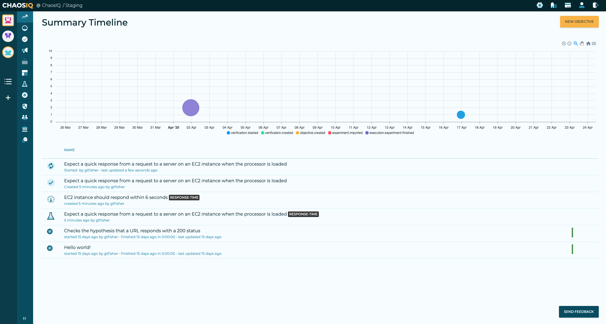
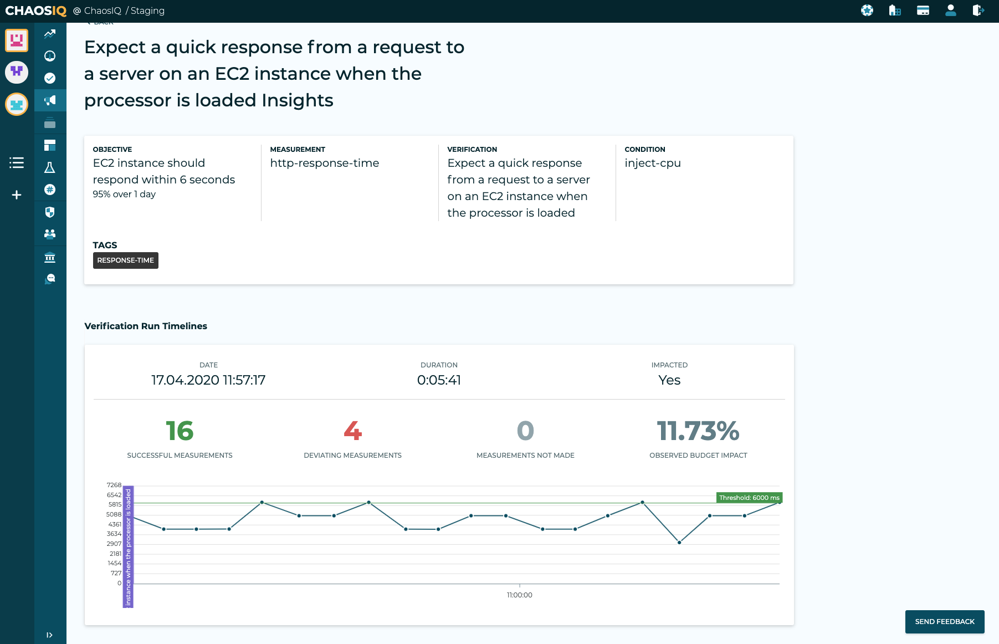

Following on from [Adrian Hornsby's][AdrianHornsbyMedium] excellent blog post on [Injecting Chaos to Amazon EC2 using AWS System Manager][InjectingChaosToAmazonEc2] this tutorial will show you how to run a Chaos Toolkit experiment and a Reliability Toolkit verification, using AWS Systems Manager (SSM).

Adrian's blog post explains what AWS Systems Manager (SSM) is and how to set it up.

## AWS EC2 Set up

You will need access to an AWS EC2 instance where you can apply some disruption. If you already have an EC2 instance, it's worth confirming if it already has an SSM agent included.
SSM Agent is installed, by default, on Amazon Linux base AMIs dated 2017.09 and later.
SSM Agent is also installed, by default, on Amazon Linux 2, Ubuntu Server 16.04, and Ubuntu Server 18.04 LTS AMIs.
If it is not included you can install the [SSM agent manually](https://docs.aws.amazon.com/systems-manager/latest/userguide/sysman-install-ssm-agent.html)

If you don't have a suitable EC2 instance available you can create an EC2 Web server with Flask using this [useful guide](https://www.codementor.io/@jqn/deploy-a-flask-app-on-aws-ec2-13hp1ilqy2). This should get you to the point where you have an EC2 instance up and running that would respond to an HTTP request.

A quick first experiment is used to confirm we are all set up to run a Chaos Toolkit experiment against the EC2 endpoint. Ensure you have followed the steps to install the [Chaos Toolkit CLI][CliInstallation].

```
{
    "version": "1.0.0",
    "title": "Running a http request on an  EC2",
    "description": "Run a http health check on EC2 instance running apache/Flask",
    "tags": ["health"],
    "configuration": {
        "endpoint_url": {
            "type": "env",
            "key": "ENDPOINT_URL"
        }
    },
    "contributions": {
        "reliability": "medium",
        "security": "none",
        "scalability": "medium"
    },
    "steady-state-hypothesis": {
        "title": "Application responds",
        "probes": [
            {
                "type": "probe",
                "name": "application-must-respond-normally",
                "tolerance": 200,
                "provider": {
                    "type": "http",
                    "timeout": 200,
                    "verify_tls": false,
                    "url": "${endpoint_url}"
                }
            }
        ]
    },
    "method": [
        {
            "type": "action",
            "name": "dummy step",
            "provider": {
                "type": "process",
                "path": "echo",
                "arguments": "The URL pinged is: ${endpoint_url}"
            }
        }

    ],
    "rollbacks": []
}
```

Run the experiment with

```bash
ENDPOINT_URL=http://ec2-52-18-8-61.eu-west-1.compute.amazonaws.com \
chaos run experiment.json
```

!!! Tip
    Add the ```--verbose``` option for more detailed logging

## AWS Systems Manager Experiment

With that set up, you can try running an experiment that will apply some CPU stress using one of Adrian's [SSM documents](https://raw.githubusercontent.com/adhorn/chaos-ssm-documents/master/cpu-stress.yml). If you have worked through Adrian's  Injecting Chaos to Amazon EC2 article you should be all set to go. Use the following experiment:

```json
{
    "version": "1.0.0",
    "title": "Expect a quick response from a request to a server on an  EC2 instance when the processor is loaded",
    "description": "Expect a quick response when the processor is loaded with an AWS SSM command.",
    "tags": ["response-time"],
    "configuration": {
        "endpoint_url": {
            "type": "env",
            "key": "ENDPOINT_URL"
        },
        "instance_id": {
            "type": "env",
            "key": "INSTANCE_ID"
        }

    },
    "contributions": {
        "reliability": "medium",
        "security": "none",
        "scalability": "medium"
    },

    "steady-state-hypothesis": {
        "title": "EC2 instance should respond within 6 seconds",
        "probes": [
            {
                "name": "http-response-time",
                "type": "probe",
                "provider": {
                    "type": "python",
                    "module": "chaoscloud.probes.http",
                    "func": "time_http_call",
                    "arguments": {
                        "url": "${endpoint_url}"
                    }
                },
                "tolerance": {
                    "name": "http-response-time-under",
                    "type": "probe",
                    "provider": {
                        "type": "python",
                        "module": "chaoscloud.tolerances.http",
                        "func": "response_time_under",
                        "arguments": {
                            "duration": 6000
                        }
                    }
                }
            }
        ]
    },
    "method": [
        {
            "type": "action",
            "name": "inject-cpu",
            "provider": {
                "type": "process",
                "path": "aws",
                "arguments": "ssm send-command --document-name \"cpu-stress\" --document-version \"1\"
--targets '[{\"Key\":\"InstanceIds\",\"Values\":[\"${instance_id}\"]}]'
--parameters '{\"duration\":[\"180\"],\"cpu\":[\"0\"]}' --timeout-seconds 60
--max-concurrency \"50\" --max-errors \"0\" --output-s3-bucket-name \"gtf-chaos-output\"
--cloud-watch-output-config '{\"CloudWatchOutputEnabled\":true}'
--region eu-west-1 --query 'Command.CommandId' > CommandId.info"
            }
        }
    ],
    "rollbacks": [
        {
            "type": "action",
            "name": "Stop SSM run command",
            "provider": {
                "type": "process",
                "path": "aws",
                "arguments": "ssm cancel-command --command-id $(cat CommandId.info) "
            },
            "pauses": {
                "after": 10
            }
        }
    ]
}
```

!!!Note
    You will need to add your own S3bucket name.


It is worth connecting to your EC2 instance now using [SSH][SshAccessToEc2] and running ```htop``` so you can see the impact of the SSM command on the CPU.

The experiment can be run with a  command similar to the following, but you should replace the ```ENDPOINT_URL``` and the ```INSTANCE_ID``` with your own EC2 values:

```bash
ENDPOINT_URL=http://ec2-52-18-8-61.eu-west-1.compute.amazonaws.com/random/4 \
INSTANCE_ID=i-086ccae1f2de9b012 \
chaos run verification-ec2-responds-processor-load-stage.json
```

Shortly after the experiment begins the ```htop``` session should look similar to:

![htop screenshot][HtopScreen]

At this point, some stress has been applied to the CPU and a Steady
 State Hypothesis has run against the EC2 endpoint. An experiment only applies
 the Steady State Hypothesis at the beginning and at the end of an experiment,
  it would be better to run it as a verification where the Steady State
  Hypothesis can be repeated over a period of time.

## Experiment Import

The Reliability Toolkit supports the import of an experiment to into
 the toolkit to upgrade it to a Verification. Login to the [Reliability Toolkit]
[RtkLogin] and navigate to the Verifications page. From the
 verifications page you have an option to import an experiment, select the
 Import Experiment button, and you will see the Experiment import screen, once
 you have selected your file you will see a screen similar to the following:

![Verification Screen][VerificationScreen]

This screen shows the probes and the single action that have been found in your experiment file.
It will also show the generated objective name and verification name, you can
change these as required.

You can then specify the target percentage for you objective and over what
time window that objective applies to.

The next thing is to set the run-time parameters for the verification, in my
case, I expect my URL to respond in between 3 and 7 seconds, so I have selected
to run the verification every 10 seconds, and as the CPU load is applied for a
period of 3 minutes, a duration for the experiment of 5 minutes seemed reasonable.

Now you can select the Create Verification and View Execution Steps, button at the
end of the page. You will be taken to the run verification page. This page shows
you how to run the verification in a local terminal where the Chaos Toolkit is installed
 along with [Chaos-Cloud plugin][AddChaosIQPlugin]. You will also need to be
 signed in to the Reliability Toolkit, please refer to these documentation links,
 to [signin to ChaosIQ][SignInChaosIQ] with a token and select your default [organization]
[SelectDefaultOrg] and [team][SelectDefaultTeam].

![Run Verification][RunVerification]

## Run the Verification

You can either run the verification from the URL provided or you can download
the verification and run it locally, or form any of the other places we have documented. The verification created is shown below:

```json
{
    "version": "1.0.0",
    "title": "Expect a quick response from a request to a server on an  EC2 instance when the processor is loaded",
    "description": "Expect a quick response when the processor is loaded with an AWS SSM command.",
    "tags": [
        "response-time"
    ],
    "configuration": {
        "endpoint_url": {
            "type": "env",
            "key": "ENDPOINT_URL"
        },
        "instance_id": {
            "type": "env",
            "key": "INSTANCE_ID"
        }
    },
    "contributions": {
        "reliability": "medium",
        "security": "none",
        "scalability": "medium"
    },
    "steady-state-hypothesis": {
        "title": "EC2 instance should respond within 6 seconds",
        "probes": [
            {
                "name": "http-response-time",
                "type": "probe",
                "provider": {
                    "type": "python",
                    "module": "chaoscloud.probes.http",
                    "func": "time_http_call",
                    "arguments": {
                        "url": "${endpoint_url}"
                    }
                },
                "tolerance": {
                    "name": "http-response-time-under",
                    "type": "probe",
                    "provider": {
                        "type": "python",
                        "module": "chaoscloud.tolerances.http",
                        "func": "response_time_under",
                        "arguments": {
                            "duration": 6000
                        }
                    }
                }
            }
        ]
    },
    "method": [
        {
            "type": "action",
            "name": "inject-cpu-load",
            "provider": {
                "type": "process",
                "path": "aws",
                "arguments": "ssm send-command --document-name \"cpu-stress\"
--document-version \"1\" --targets '[{\"Key\":\"InstanceIds\",
\"Values\":[\"${instance_id}\"]}]' --parameters '{\"duration\":[\"180\"],
\"cpu\":[\"0\"]}' --timeout-seconds 60 --max-concurrency \"50\"
--max-errors \"0\" --output-s3-bucket-name \"gtf-chaos-output\"
--cloud-watch-output-config '{\"CloudWatchOutputEnabled\":true}'
--region eu-west-1 --query 'Command.CommandId' > CommandId.info"
            }
        }
    ],
    "rollbacks": [
        {
            "type": "action",
            "name": "Stop SSM run command",
            "provider": {
                "type": "process",
                "path": "aws",
                "arguments": "ssm cancel-command --command-id $(cat CommandId.info) "
            },
            "pauses": {
                "after": 10
            }
        }
    ],
    "extensions": [
        {
            "name": "chaosiq",
            "experiment_id": "461d862b-0a5f-45cf-ab66-bc0aef02a59c",
            "objective_id": "997da1a4-c511-4337-9652-4b9a25c5cbfe",
            "verification": {
                "id": "dd1e52d0-454a-40b8-8864-5d34834191e6",
                "frequency-of-measurement": 10,
                "duration-of-conditions": 300.0
            },
            "team_id": "f3a36d51-2486-4eb1-9fe3-29b4ea8fb387",
            "org_id": "ae4458ef-a457-4bd5-8e6b-7c7a21db6d7f"
        }
    ]
}

```

The verification be run with:

```bash
 ENDPOINT_URL=http://ec2-52-18-8-61.eu-west-1.compute.amazonaws.com/random/4 \
 INSTANCE_ID=i-086ccae1f2de9b012 \
 chaos verify verification-ec2-responds-processor-load.json
```

The ```ENDPOINT_URL``` and the ```INSTANCE_ID```, should be replaced with values
for your own EC2 instance.

## Summary Timeline

The verification will run for five minutes and you can see it in the running
state on the Reliability Toolkit Summary Timeline page:



Great job! You've run your SSM verification and surfaced the experiment's information into your Timeline. The Timeline is the place where you begin to explore and understand What Happened(TM), exploring your verification as a planned incident to see how your system reacted and verify the many different parallel activities that occur at the same time during the verification's execution.

## Verification Insights

In addition to populating your Reliability Summary Timeline, when the
verification has completed an insights view will be generated for the
verification:



The insights page shows the details of the verification that has been run and a
timeline showing the measurements made during the verification. This includes
successful measurements and deviated measurements. It also shows the observed
impact on the error budget. This indicates that there are some issues with this
service, that will some attention to rectify its reliability issues.

In this tutorial you have covered the steps to create and EC2 instance and run an
AWS Systems Command against it using the Chaos Toolkit, using an
 experiment and a verification. We have also looked at some of the views that
 are generated in the ChaosIQ Reliability Toolkit.

[AdrianHornsbyMedium]: https://medium.com/@adhorn
[InjectingChaosToAmazonEc2]: https://medium.com/@adhorn/injecting-chaos-to-amazon-ec2-using-amazon-system-manager-ca95ee7878f5
[SshAccessToEc2]: https://aws.amazon.com/blogs/compute/new-using-amazon-ec2-instance-connect-for-ssh-access-to-your-ec2-instances/
[CliInstallation]: /getting-started/prerequisites/#creating-a-new-chaos-toolkit-cli-installation-using-pip
[RtkLogin]: https://console.chaosiq.io/login
[HtopScreen]: ./assets/htop-screen.png
[VerificationScreen]: ./assets/verification-screen.png
[AddChaosIQPlugin]:/getting-started/prerequisites/#add-the-chaosiq-plugin-to-your-chaos-toolkit
[SignInChaosIQ]: /getting-started/chaostoolkit-signin
[SelectDefaultOrg]: /organizations-and-teams/switching-organizations
[SelectDefaultTeam]: /organizations-and-teams/switching-teams
[RunVerification]: ./assets/run-verification.png


